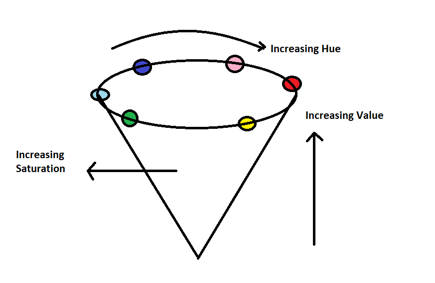

# image-quality
imageQ allows you to get a clearer image when using the images on the system. It has been made more advantageous for use on Docker.

## Color Values
It stores color information in a cylindrical representation of RGB color points. It attempts to depict the colors as perceived by the human eye. Hue value varies from 0-179, Saturation value varies from 0-255 and Value value varies from
```python
colorspace_factor = np.random.choice([0 - 179], 1)[0]
        colorspace_saturation = random.choice([0 - 255], 1)[0]
```



Thanks to the images used `_dataset_`, the archived images maintain their quality and the images are saved in the background within the system.